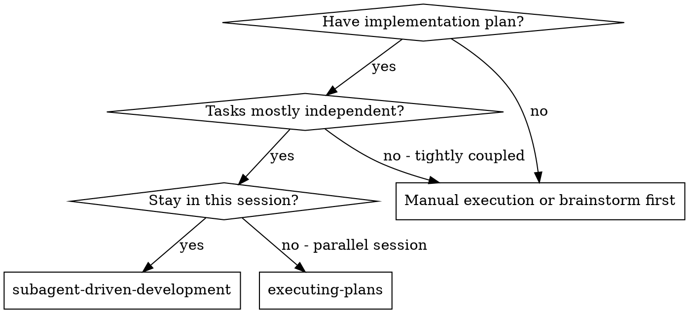
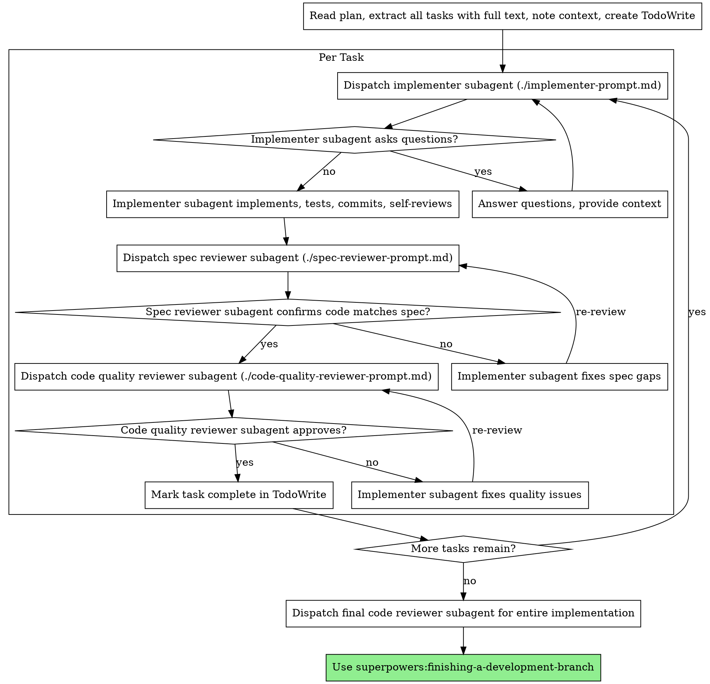

# Subagent-Driven Development

Execute plan by dispatching fresh subagent per task, with two-stage review after each: spec compliance review first, then code quality review.

**Why subagents:** You delegate tasks to specialized agents with isolated context. By precisely crafting their instructions and context, you ensure they stay focused and succeed at their task. They should never inherit your session's context or history — you construct exactly what they need. This also preserves your own context for coordination work.

**Core principle:** Fresh subagent per task + two-stage review (spec then quality) = high quality, fast iteration

**Continuous execution:** Do not pause to check in with your human partner between tasks. Execute all tasks from the plan without stopping. The only reasons to stop are: BLOCKED status you cannot resolve, ambiguity that genuinely prevents progress, or all tasks complete. "Should I continue?" prompts and progress summaries waste their time — they asked you to execute the plan, so execute it.

## When to Use



**vs. Executing Plans (parallel session):**
- Same session (no context switch)
- Fresh subagent per task (no context pollution)
- Two-stage review after each task: spec compliance first, then code quality
- Faster iteration (no human-in-loop between tasks)

## Task Parallelization

**Before starting execution, analyze all tasks for parallelism opportunities:**

1. **If tasks edit completely different files** (no overlapping paths) → they are safely parallelizable
2. **If tasks edit the same file but different sections** → may be parallelizable with care; prefer sequential
3. **If tasks share dependencies or state** → must be sequential

**For safely parallelizable tasks**, dispatch them concurrently using `subagent({ tasks: [...] })` to save time. Each parallel task still goes through the same implement→spec-review→code-review cycle independently.

**Example:**
```
// Tasks 1-3 all touch different files → safe to parallelize
subagent({ tasks: [
  { agent: "superpowers-worker", task: "<Task 1: auth module, files: src/auth/*>" },
  { agent: "superpowers-worker", task: "<Task 2: payment module, files: src/payment/*>" },
  { agent: "superpowers-worker", task: "<Task 3: notification module, files: src/notify/*>" },
], concurrency: 3 })
// Then review each result independently
```

## The Process

### Phase 0: Analyze and Group

1. Read the plan file once
2. Extract all tasks with full text and context
3. **Analyze task dependencies** — which tasks touch which files?
   - Tasks touching **completely different files** → independent, can run in parallel
   - Tasks touching **same files** → dependent, must run sequentially
4. **Group independent tasks** into parallel batches using `superpowers:dispatching-parallel-agents`
5. Create TodoWrite with all tasks
6. **Build context for worker（推荐）** — 派 `context-builder` 生成 worker 专用上下文和 meta-prompt，避免主会话手动翻文件：

   ```typescript
   subagent({ agent: "context-builder", task: `
     分析当前代码库中与以下任务相关的代码：
     [任务描述]
     
     产出 context.md（相关文件/模式/约束/风险）和 meta-prompt.md（
     目标、上下文、成功标准、硬约束、验证方式、停止规则）。
     meta-prompt 是给 worker agent 用的即用提示。
   ` })
   ```

   拿到 context.md 和 meta-prompt.md 后，派发 worker 时直接把这些内容塞进 task 里，
   不用让 worker 自己去读文件。对于复杂任务、大型代码库尤其有用。
   简单任务可跳过此步。

### Phase 1-N: Execute Each Task (or Parallel Batch)

For independent task batches, dispatch in parallel:
```
subagent({ tasks: [
  { agent: "superpowers-worker", task: "<Task A: files in src/module-a/>" },
  { agent: "superpowers-worker", task: "<Task B: files in src/module-b/>" },
], concurrency: 3 })
```

Each task (whether parallel or sequential) follows the per-task cycle below:



## 编排模式（Orchestration Patterns）

pi-subagents 支持 6 种编排模式，根据任务规模和复杂度选择：

### 模式 1：单 Agent — 简单任务

最基础的用法，一个 worker 实现、一个 reviewer 审查：

```typescript
// 实现
subagent({ agent: "superpowers-worker", task: "实现 Task 1: 添加登录表单" })

// 审查
subagent({ agent: "superpowers-reviewer", task: "审查 Task 1 的实现" })
```

**适用**：单个简单任务，无并行需求。

### 模式 2：顶层 Parallel — 多个独立任务并发

分析依赖后，把操作不同文件的任务并行派发：

```typescript
subagent({ tasks: [
  { agent: "superpowers-worker", task: "Task 1: auth 模块 (src/auth/)" },
  { agent: "superpowers-worker", task: "Task 2: payment 模块 (src/payment/)" },
  { agent: "superpowers-worker", task: "Task 3: notify 模块 (src/notify/)" },
], concurrency: 3 })
```

每个 task 还可以**多次派发同一个 agent**：

```typescript
subagent({ tasks: [
  { agent: "superpowers-reviewer", task: "审查 auth 模块的 spec 合规性", count: 2 },
] })
// 2 个 reviewer 各自审同一个模块，互不干扰
```

**适用**：3+ 个完全独立的文件改动，没有共享状态。

### 模式 3：Chain — 串行流水线

侦察 → 规划 → 实现 → 审查，一步步传下去：

```typescript
subagent({ chain: [
  { agent: "scout", task: "扫描认证模块 → context.md" },
  { agent: "planner", task: "基于 {previous} 写实现计划 → plan.md" },
  { agent: "superpowers-worker", task: "执行计划" },
  { agent: "superpowers-reviewer", task: "审查最终实现" },
] })
```

上一步输出通过 `{previous}` 传给下一步。也可以用 `as: "name"` 给步骤命名，后续用 `{outputs.name}` 精确引用。

**适用**：有明确先后顺序的多步骤流程。

### 模式 4：Chain + Parallel — 混合流水线

效果最好的模式。准备阶段串行，审查阶段并行，修复阶段串行：

```typescript
subagent({ chain: [
  // Step 1: 单 agent 准备上下文
  { agent: "context-builder", task: `
    分析当前任务涉及的代码，生成：
    - context.md（相关文件/模式/约束/风险）
    - meta-prompt.md（给 worker 的即用提示）
  ` },

  // Step 2: 2 个 reviewer 并行审查（互不等待，节省约 50% 时间）
  { parallel: [
    { agent: "superpowers-reviewer", task: "spec 合规性审查（对照需求逐项核对）" },
    { agent: "superpowers-reviewer", task: "代码质量审查（clean code/测试/异常处理）" },
  ], concurrency: 2 },

  // Step 3: 单 agent 汇总修复
  { agent: "superpowers-worker", task: `
    合并两份审查报告（{previous}）：
    1. 去重 → 分类（Critical / Important / Minor）
    2. 自动修复可确认的问题
    3. 标记需人工决策的问题
    4. 输出 SUMMARY.md
  ` },
] })
```

**适用**：中大型任务，需要高质量审查 + 自动修复闭环。这是推荐的默认模式。

### 模式 5：Dynamic Fanout — 动态并行

先让一个 agent 输出结构化结果，再**自动拆 N 路**并行：

```typescript
subagent({ chain: [
  // 第一步：scout 找出所有需要审查的文件
  { agent: "scout", task: `
    扫描项目，找出所有需要审查的源文件。
    返回 { items: [{ path: "src/auth/login.ts", reason: "新增文件" }, ...] }
  `, as: "targets", outputSchema: { type: "object" } },

  // 第二步：按结果动态展开 — 每个文件一个 reviewer
  { expand: {
    from: { output: "targets", path: "/items" },
    item: "target", key: "/path",
    maxItems: 12
  },
    parallel: {
      agent: "superpowers-reviewer",
      task: "审查 {target.path}（原因: {target.reason}）"
    },
    collect: { as: "reviews" },
    concurrency: 4 },

  // 第三步：汇总修复
  { agent: "superpowers-worker", task: "合并 {outputs.reviews} 中的所有审查结果，自动修复后输出 SUMMARY.md" },
] })
```

**效果**：scout 找到 12 个文件 → 自动 12 路 reviewer → 4 并发分批跑 → 汇总。不用手写 Parallel 列表。

**适用**：大型项目，检查范围不确定，需要动态生成并行任务。

### 模式 6：三阶段编排（Staged Fix） — 大批量安全修改

最安全的模式：只读规划（并行）→ 单写线程（串行）→ 只读验证（并行）：

```
Phase 1 (只读规划)         Phase 2 (单写线程)     Phase 3 (只读验证)
  ┌─ reviewer ─┐              ┌─ worker ─┐          ┌─ reviewer ─┐
  │ Plan fix A  │              │  单线程    │          │ 验证 fix A  │
  ├─ reviewer ─┤      →       │  写所有    │    →     ├─ reviewer ─┤
  │ Plan fix B  │    (并行 3)  │  accepted  │          │ 验证 fix B  │
  ├─ reviewer ─┤              │  fixes    │          ├─ reviewer ─┤
  │ Plan fix C  │              └───────────┘          │ 验证 fix C  │
  └─────────────┘                                     └─────────────┘
                                                          (并行 3)
```

```typescript
subagent({ async: true, context: "fresh", chain: [
  // Phase 1: 并行只读规划（不碰文件）
  { parallel: [
    { agent: "superpowers-reviewer", as: "planA", task: `
      审查 auth 模块的问题，给出修复计划（只读，不修改文件）。
      输出修复目标文件列表 + 具体改动方案。
    `, output: "plans/auth.md", outputMode: "file-only" },
    { agent: "superpowers-reviewer", as: "planB", task: `
      审查 payment 模块的问题，给出修复计划（只读，不修改文件）。
    `, output: "plans/payment.md", outputMode: "file-only" },
    { agent: "superpowers-reviewer", as: "planC", task: `
      审查 notify 模块的问题，给出修复计划（只读，不修改文件）。
    `, output: "plans/notify.md", outputMode: "file-only" },
  ], concurrency: 3 },

  // Phase 2: 单写线程（唯一允许编辑的 agent）
  { agent: "superpowers-worker", task: `
    你是唯一的写入线程。
    Auth 计划: {outputs.planA}
    Payment 计划: {outputs.planB}
    Notify 计划: {outputs.planC}

    只应用 accepted 的修复。完成后跑验证命令。
    报告改动文件、运行命令和退出码、遗留问题。
  `, output: "worker/fixes.md", outputMode: "file-only", progress: true },

  // Phase 3: 并行只读验证
  { parallel: [
    { agent: "superpowers-reviewer", task: "验证 auth + payment 修复（从 {outputs.planA} 和 {outputs.planB} 检查 diff）" },
    { agent: "superpowers-reviewer", task: "验证 notify 修复（从 {outputs.planC} 检查 diff）" },
  ], concurrency: 2 },
] })
```

**适用**：大批量跨模块修改、重构、多文件审查后统一修复。避免多个 worker 同时写同一个工作区导致冲突。

### 模式选择速查

| 场景 | 推荐模式 |
|------|----------|
| 单个简单任务 | 模式 1：单 Agent |
| 3+ 个不相关的文件改动 | 模式 2：顶层 Parallel |
| 有明确前后依赖的流程 | 模式 3：Chain |
| 中大型任务需审查+修复 | **模式 4：Chain+Parallel（推荐）** |
| 检查范围不确定的大型项目 | 模式 5：Dynamic Fanout |
| 大批量跨模块安全修改 | 模式 6：三阶段编排 |

---

## Model Selection

Use the least powerful model that can handle each role to conserve cost and increase speed.

**Mechanical implementation tasks** (isolated functions, clear specs, 1-2 files): use a fast, cheap model. Most implementation tasks are mechanical when the plan is well-specified.

**Integration and judgment tasks** (multi-file coordination, pattern matching, debugging): use a standard model.

**Architecture, design, and review tasks**: use the most capable available model.

**Task complexity signals:**
- Touches 1-2 files with a complete spec → cheap model
- Touches multiple files with integration concerns → standard model
- Requires design judgment or broad codebase understanding → most capable model

## Handling Implementer Status

Implementer subagents report one of four statuses. Handle each appropriately:

**DONE:** Proceed to spec compliance review.

**DONE_WITH_CONCERNS:** The implementer completed the work but flagged doubts. Read the concerns before proceeding. If the concerns are about correctness or scope, address them before review. If they're observations (e.g., "this file is getting large"), note them and proceed to review.

**NEEDS_CONTEXT:** The implementer needs information that wasn't provided. Provide the missing context and re-dispatch.

**BLOCKED:** The implementer cannot complete the task. **不要自己硬扛判断原因**——先派 `oracle` agent 诊断：

```typescript
subagent({ agent: "oracle", task: `
  Worker 在实现 Task [N] 时卡住了，报告如下：
  [worker 的 BLOCKED 报告原文]
  
  请诊断：
  1. 根因是什么（上下文不足 / 需要更强模型 / 任务太大 / 计划本身有问题）？
  2. 推荐下一步（重派 + 补上下文 / 升级模型 / 拆分任务 / 找用户修改计划）？
  3. 如果推荐重派，给出一个改进后的 worker prompt。
` })
```

oracle 给出诊断和推荐后，按推荐路径执行：
1. 如果是上下文问题 → 按 oracle 的建议补充上下文，重新派发
2. 如果需要更强模型 → 用 oracle 推荐的模型 + prompt 重新派发
3. 如果任务太大 → 按 oracle 建议拆分成小任务
4. 如果计划本身有问题 → 带着 oracle 的分析找用户讨论

**Never** ignore an escalation or force the same model to retry without changes. If the implementer said it's stuck, something needs to change.

## Prompt Templates

- `./implementer-prompt.md` - Dispatch implementer subagent
- `./spec-reviewer-prompt.md` - Dispatch spec compliance reviewer subagent
- `./code-quality-reviewer-prompt.md` - Dispatch code quality reviewer subagent

## Example Workflow

```
You: I'm using Subagent-Driven Development to execute this plan.

[Read plan file once: docs/superpowers/plans/feature-plan.md]
[Extract all 5 tasks with full text and context]
[Create TodoWrite with all tasks]

Task 1: Hook installation script

[Get Task 1 text and context (already extracted)]
[Dispatch implementation subagent with full task text + context]

Implementer: "Before I begin - should the hook be installed at user or system level?"

You: "User level (~/.config/superpowers/hooks/)"

Implementer: "Got it. Implementing now..."
[Later] Implementer:
  - Implemented install-hook command
  - Added tests, 5/5 passing
  - Self-review: Found I missed --force flag, added it
  - Committed

[Dispatch spec compliance reviewer]
Spec reviewer: ✅ Spec compliant - all requirements met, nothing extra

[Get git SHAs, dispatch code quality reviewer]
Code reviewer: Strengths: Good test coverage, clean. Issues: None. Approved.

[Mark Task 1 complete]

Task 2: Recovery modes

[Get Task 2 text and context (already extracted)]
[Dispatch implementation subagent with full task text + context]

Implementer: [No questions, proceeds]
Implementer:
  - Added verify/repair modes
  - 8/8 tests passing
  - Self-review: All good
  - Committed

[Dispatch spec compliance reviewer]
Spec reviewer: ❌ Issues:
  - Missing: Progress reporting (spec says "report every 100 items")
  - Extra: Added --json flag (not requested)

[Implementer fixes issues]
Implementer: Removed --json flag, added progress reporting

[Spec reviewer reviews again]
Spec reviewer: ✅ Spec compliant now

[Dispatch code quality reviewer]
Code reviewer: Strengths: Solid. Issues (Important): Magic number (100)

[Implementer fixes]
Implementer: Extracted PROGRESS_INTERVAL constant

[Code reviewer reviews again]
Code reviewer: ✅ Approved

[Mark Task 2 complete]

...

[After all tasks]
[Dispatch final code-reviewer]
Final reviewer: All requirements met, ready to merge

Done!
```

## Advantages

**vs. Manual execution:**
- Subagents follow TDD naturally
- Fresh context per task (no confusion)
- Parallel-safe (subagents don't interfere)
- Subagent can ask questions (before AND during work)

**vs. Executing Plans:**
- Same session (no handoff)
- Continuous progress (no waiting)
- Review checkpoints automatic

**Efficiency gains:**
- No file reading overhead (controller provides full text)
- Controller curates exactly what context is needed
- Subagent gets complete information upfront
- Questions surfaced before work begins (not after)

**Quality gates:**
- Self-review catches issues before handoff
- Two-stage review: spec compliance, then code quality
- Review loops ensure fixes actually work
- Spec compliance prevents over/under-building
- Code quality ensures implementation is well-built

**Cost:**
- More subagent invocations (implementer + 2 reviewers per task)
- Controller does more prep work (extracting all tasks upfront)
- Review loops add iterations
- But catches issues early (cheaper than debugging later)

## Red Flags

**Never:**
- Start implementation on main/master branch without explicit user consent
- Skip reviews (spec compliance OR code quality)
- Proceed with unfixed issues
- Make subagent read plan file (provide full text instead)
- Skip scene-setting context (subagent needs to understand where task fits)
- Ignore subagent questions (answer before letting them proceed)
- Accept "close enough" on spec compliance (spec reviewer found issues = not done)
- Skip review loops (reviewer found issues = implementer fixes = review again)
- Let implementer self-review replace actual review (both are needed)
- **Start code quality review before spec compliance is ✅** (wrong order)
- Move to next task while either review has open issues

**If subagent asks questions:**
- Answer clearly and completely
- Provide additional context if needed
- Don't rush them into implementation

**If reviewer finds issues:**
- Implementer (same subagent) fixes them
- Reviewer reviews again
- Repeat until approved
- Don't skip the re-review

**If subagent fails task:**
- Dispatch fix subagent with specific instructions
- Don't try to fix manually (context pollution)

## Pi Platform Adaptation / Pi 平台适配

使用 `pi-subagents` 扩展（nicobailon/pi-subagents）的 `subagent` 工具替代 `Task`：

- **派发实现者** → `subagent({ agent: "superpowers-worker", task: "..." })`
- **派发 spec reviewer** → `subagent({ agent: "superpowers-reviewer", task: "审查 spec: ..." })`
- **派发 code quality reviewer** → `subagent({ agent: "superpowers-reviewer", task: "审查代码质量: ..." })`
- **并行派发** → `subagent({ tasks: [{ agent: "...", task: "..." }, ...] })`
- **流水线** → `subagent({ chain: [{ agent: "superpowers-worker", ... }, { agent: "superpowers-reviewer", ... }] })`

推荐使用 Chain 模式串联 实现→审查→修复 流程，或 Parallel 模式并发审查多个维度。
详见 `pi-subagents` 技能说明。

## Integration

**Required workflow skills:**
- **superpowers:using-git-worktrees** - Ensures isolated workspace (creates one or verifies existing)
- **superpowers:writing-plans** - Creates the plan this skill executes
- **superpowers:requesting-code-review** - Code review template for reviewer subagents
- **superpowers:finishing-a-development-branch** - Complete development after all tasks

**Subagents should use:**
- **superpowers:test-driven-development** - Subagents follow TDD for each task

**Alternative workflow:**
- **superpowers:executing-plans** - Use for parallel session instead of same-session execution
